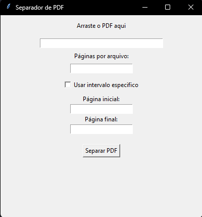

# PDF Splitter

Aplicação desktop em Python para separar arquivos PDF de forma personalizada.
Ferramenta criada para facilitar a divisão de documentos PDF em ambientes corporativos.



## Funcionalidades

- Drag and Drop de arquivos
- Separação por quantidade de páginas
- Separação por intervalo específico
- Interface gráfica amigável

## Tecnologias usadas

- Python
- Tkinter
- tkinterdnd2
- pypdf

## Como executar

```bash
pip install -r requirements.txt
python main.py